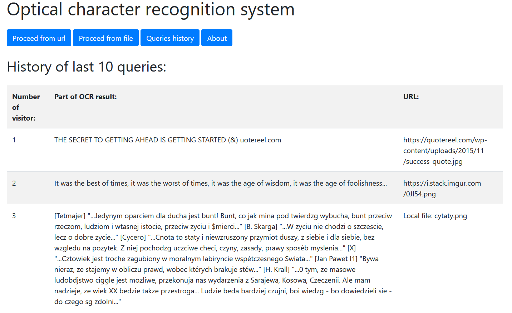

# OCR System
#### Optical character recognition system 

## General
The application provides optical character recognition(OCR) for images uploaded from a URL address or local file. 
For OCR used [Tess4J library](https://github.com/nguyenq/tess4j) which is a Java wrapper for 
[Tesseract OCR API](https://tesseract-ocr.github.io/).
User can view historical data of up to 10 queries. The data is stored in the H2 in-memory database.

The application supports two languages: English and Polish. It is possible to extend the support to other languages.
It is necessary to download the [tessdata for Tesseract](https://github.com/tesseract-ocr/tessdata) in the required 
language and add it to _./tessdata/_.

### Demo
The demo version of the application does not have the function of checking historical data due to user privacy. One user 
cannot check other user's queries. Source code to demo version is on another branch 
[demo-version](https://github.com/Pozadr/OCR_System).

### Endpoint to run application locally
    localhost:8080/ocr-main

## Configuration
application.properties file:

    spring.datasource.platform=h2
    spring.datasource.url=jdbc:h2:mem:db
    spring.h2.console.enabled=true
    spring.h2.console.path=/console
    spring.jpa.hibernate.ddl-auto=<create/update>
    spring.jpa.show-sql=<true/false>
    
    # max file size - default 1MB
    spring.servlet.multipart.max-file-size=10MB
    # max request size - default 10MB
    spring.servlet.multipart.max-request-size=25MB

## Technologies
- Java 11
- Maven
- Spring Boot 2.4.0
- Thymeleaf
- Bootstrap(CSS)
- JQuery/JavaScript
- Tess4J
- Swagger 2

## Screenshots

